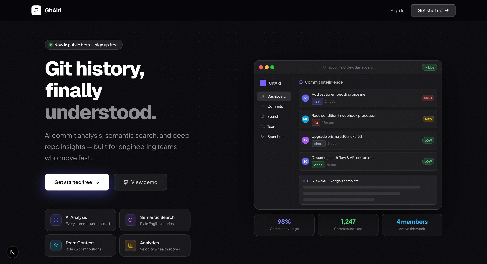
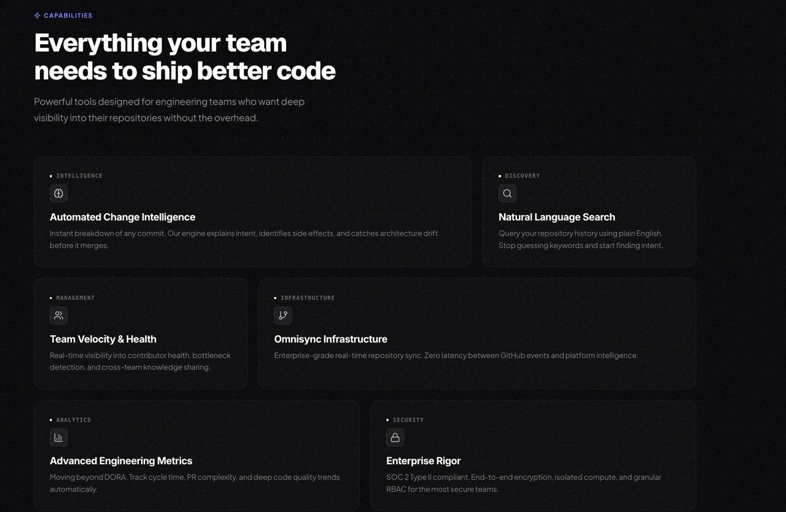
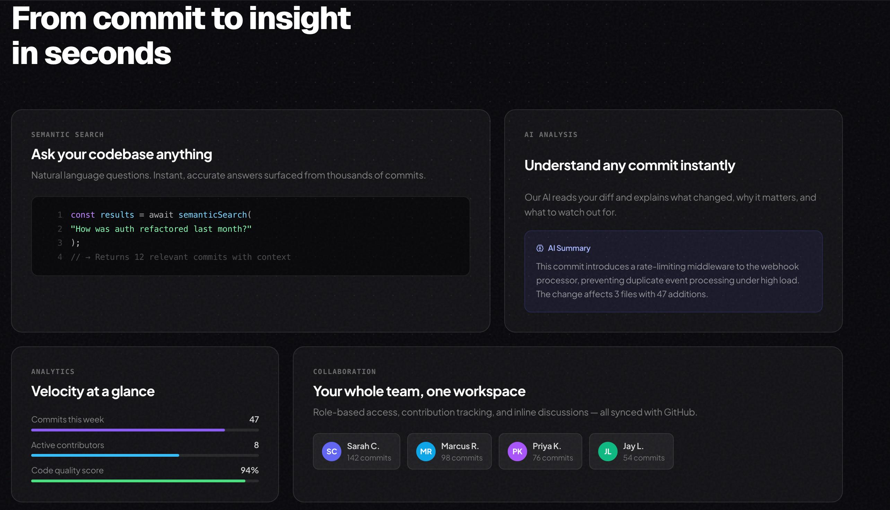
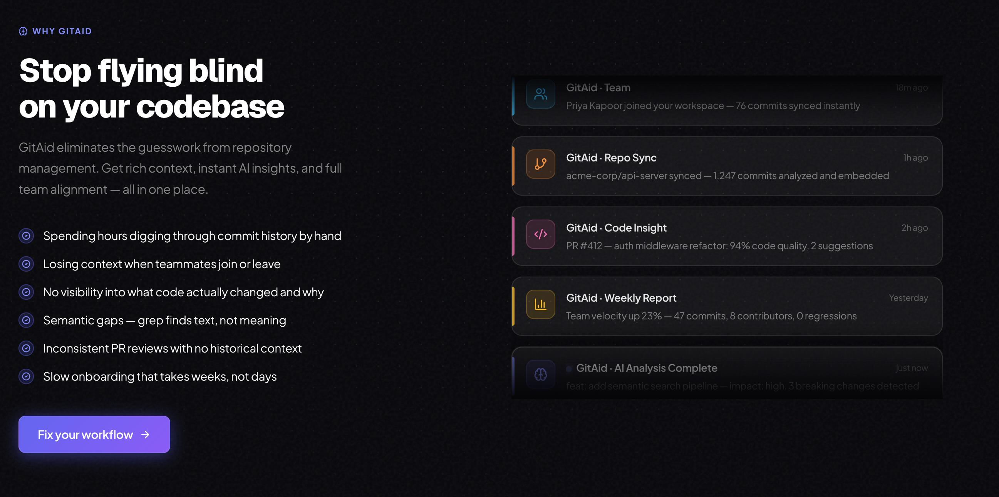
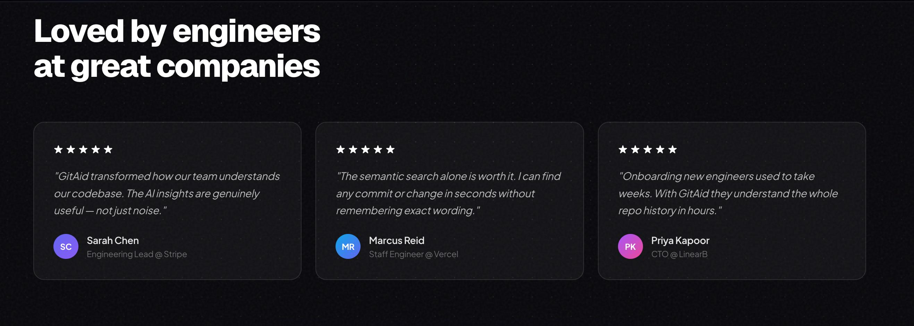
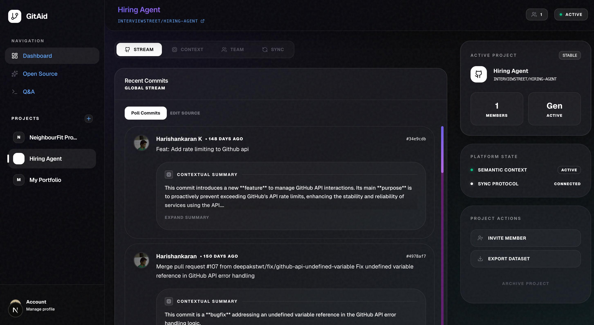

# 🚀 GitAid - AI-Powered Git Management Platform

<div align="center">


**An intelligent GitHub repository manager with AI-powered commit analysis and semantic search capabilities**

[🌟 Features](#-features) • [🚀 Quick Start](#-quick-start) • [📖 Documentation](#-documentation) • [🧪 Testing](#-testing) • [🤝 Contributing](#-contributing)

</div>

---

## 📸 Screenshots

<div align="center">

### 🏠 Landing Page


### ⚡ Capabilities


### 🔍 Semantic Search & AI Analysis


### 💡 Why GitAid


### ⭐ Testimonials


### 🎯 Dashboard


</div>

---

## 📚 Documentation & Project Structure

**New to the project?** Check out these guides:

- 🎨 **[Components Guide](frontend/client/components/README.md)** - Frontend components documentation
- 🔧 **[Server Guide](backend/server/README.md)** - Backend API and tRPC documentation

**Key Concepts:**
- **Frontend**: `frontend/src/app/` (pages), `frontend/client/components/` (React components), `frontend/client/hooks/` (React hooks)
- **Backend**: `backend/server/api/` (API logic), `backend/server/lib/` (server utilities), `backend/prisma/` (database)
- **Shared**: `frontend/client/trpc/` (tRPC client setup)

---

## ✨ Features

### 🤖 **AI-Powered Commit Analysis**
- **Smart Summarization**: Automatic commit message analysis using Google Gemini AI
- **Code Diff Analysis**: Understands actual code changes for better insights
- **Intelligent Fallbacks**: Pattern-based analysis when AI is unavailable
- **Multi-language Support**: Works with any programming language

### 🔍 **Advanced Search & Discovery**
- **Semantic Search**: Vector-based search using pgvector and embeddings
- **RAG Implementation**: Retrieval-Augmented Generation for intelligent queries
- **Repository Indexing**: Automatic code indexing for better searchability
- **Context-Aware Results**: Understands code context and relationships

### 🏗️ **Enterprise-Grade Architecture**
- **Next.js 15**: Latest React framework with App Router
- **Type Safety**: Full TypeScript implementation
- **Database**: PostgreSQL with Prisma ORM and pgvector extension
- **Authentication**: Secure user management with Clerk
- **Real-time Updates**: tRPC for type-safe API communication

### 🎨 **Modern UI/UX**
- **Responsive Design**: Mobile-first approach with Tailwind CSS
- **Component Library**: Radix UI components with shadcn/ui
- **Dark/Light Mode**: Theme switching support
- **Interactive Elements**: Rich data visualizations with Recharts

---

## 🏃‍♂️ Quick Start

### Prerequisites

- **Node.js** 18+ 
- **PostgreSQL** 14+ with pgvector extension
- **Git** for version control
- **Google Gemini API Key** (optional - fallbacks available)
- **GitHub Personal Access Token**

### 🔧 Installation

1. **Clone the repository**
   ```bash
   git clone https://github.com/yourusername/git-gud-manager.git
   cd git-gud-manager
   ```

2. **Install dependencies**
   ```bash
   cd frontend
   npm install
   ```

3. **Set up environment variables**
   ```bash
   cp backend/.env.example backend/.env
   ```
   
   Configure your `backend/.env` file with your actual values.

4. **Set up the database**
   ```bash
   # Install pgvector extension in PostgreSQL
   cd backend
   npx prisma migrate dev
   
   # Generate Prisma client
   npx prisma generate
   ```

5. **Start the development server**
   ```bash
   cd frontend
   npm run dev
   ```

6. **Open your browser**
   Navigate to `http://localhost:3001` and start exploring!

---

## 📖 Documentation

### 🏗️ **Architecture Overview**

```
GitAid/
├── frontend/
│   ├── src/app/               # Next.js App Router
│   ├── client/components/     # Reusable UI components
│   ├── client/lib/            # Frontend utilities
│   ├── client/hooks/          # React hooks
│   ├── client/trpc/          # tRPC client setup
│   ├── public/               # Static assets
│   └── config/               # Frontend configuration
├── backend/
│   ├── server/api/           # tRPC API routes
│   ├── server/lib/           # Core business logic
│   │   ├── ai.ts            # AI integration (Gemini)
│   │   ├── github.ts        # GitHub API integration
│   │   ├── embeddings.ts    # Vector embeddings
│   │   ├── rag-pipeline.ts  # RAG implementation
│   │   └── database.ts      # Database operations
│   ├── prisma/              # Database schema & migrations
│   └── scripts/             # Utility scripts
└── README.md                # Project documentation
```

### 🔑 **Core Technologies**

| Technology | Purpose | Version |
|------------|---------|---------|
| **Next.js** | Full-stack React framework | 15.2.3 |
| **TypeScript** | Type-safe development | 5.8.2 |
| **Prisma** | Database ORM & migrations | 6.5.0 |
| **PostgreSQL** | Primary database | 14+ |
| **pgvector** | Vector similarity search | Latest |
| **Clerk** | Authentication & user management | 6.31.8 |
| **Gemini AI** | AI-powered analysis | 0.24.1 |
| **tRPC** | Type-safe API layer | 11.0.0 |
| **Tailwind CSS** | Utility-first styling | 4.0.15 |
| **Radix UI** | Accessible component primitives | Latest |

---

## 🧪 Testing

### **Test Structure**
```bash
tests/
├── unit/                  # 26 unit tests
├── integration/           # Integration tests
├── utilities/             # Database utilities
└── verification/          # System verification
```

### **Running Tests**

```bash
# Run all tests
npm run test:all

# Specific test categories
npm run test:ai          # AI functionality tests
npm run test:database    # Database connection tests

# Utility commands
npm run utility:check-summaries    # Check AI summary status
npm run utility:view-db           # View database contents
npm run utility:clear-summaries   # Clear AI summaries

# Development utilities
npm run db:studio        # Open Prisma Studio
npm run verify:implementation     # System verification
```

### **Test Coverage**
- ✅ **AI Integration**: Gemini API connection and fallbacks
- ✅ **Database Operations**: CRUD operations and migrations
- ✅ **GitHub Integration**: Repository loading and commit analysis
- ✅ **RAG Pipeline**: Vector search and embeddings
- ✅ **Authentication**: User management and permissions
- ✅ **API Endpoints**: All tRPC procedures

---

---

## 🛠️ Development

### **Available Scripts**

| Command | Description |
|---------|-------------|
| `cd frontend && npm run dev` | Start development server |
| `cd frontend && npm run lint` | Run ESLint |
| `cd frontend && npm run lint:fix` | Fix ESLint issues |
| `cd frontend && npm run typecheck` | Run TypeScript checks |
| `cd frontend && npm run format:check` | Check code formatting |
| `cd frontend && npm run format:write` | Format code with Prettier |
| `cd backend && npx prisma migrate dev` | Run database migrations |
| `cd backend && npx prisma studio` | Open Prisma Studio |
| `cd backend && npx prisma db push` | Push database schema changes |

### **Development Workflow**

1. **Create a feature branch**
   ```bash
   git checkout -b feature/amazing-feature
   ```

2. **Make your changes**
   - Follow TypeScript best practices
   - Add tests for new functionality
   - Update documentation as needed

3. **Test your changes**
   ```bash
   npm run test:all
   npm run typecheck
   npm run lint
   ```

4. **Submit a pull request**
   - Provide clear description
   - Reference related issues
   - Ensure all tests pass

---

## 🔧 Configuration

### **Environment Variables**

| Variable | Description | Required |
|----------|-------------|----------|
| `DATABASE_URL` | PostgreSQL connection string | ✅ |
| `NEXT_PUBLIC_CLERK_PUBLISHABLE_KEY` | Clerk public key | ✅ |
| `CLERK_SECRET_KEY` | Clerk secret key | ✅ |
| `GEMINI_API_KEY` | Google Gemini API key | ✅ |
| `GITHUB_TOKEN` | GitHub personal access token | ✅ |

### **Database Setup**

1. **Install pgvector extension**
   ```sql
   CREATE EXTENSION IF NOT EXISTS vector;
   ```

2. **Run setup script**
   ```bash
   psql -d your_database -f setup-pgvector.sql
   ```

3. **Verify installation**
   ```bash
   npm run verify:pgvector
   ```

---

## 🤝 Contributing

We welcome contributions! Please see our [Contributing Guide](docs/CONTRIBUTING.md) for details.

### **Code of Conduct**
This project follows the [Contributor Covenant](https://www.contributor-covenant.org/) Code of Conduct.

### **Issues & Discussions**
- 🐛 **Bug Reports**: Use GitHub Issues
- 💡 **Feature Requests**: GitHub Discussions
- ❓ **Questions**: GitHub Discussions Q&A

---

## 📄 License

This project is licensed under the MIT License - see the [LICENSE](frontend/LICENSE) file for details.

---

## 🙏 Acknowledgments

- **Google Gemini AI** for intelligent commit analysis
- **Next.js** for the React framework
- **Clerk** for authentication infrastructure
- **Prisma** for database tooling
- **Radix UI** for accessible component primitives
- **Tailwind CSS** for utility-first styling

---

## 📞 Support

- 📧 **Email**: support@git-gud-manager.com
- 💬 **Discord**: [Join our community](https://discord.gg/git-gud-manager)
- 📖 **Documentation**: [docs.git-gud-manager.com](https://docs.git-gud-manager.com)
- 🐛 **Issues**: [GitHub Issues](https://github.com/yourusername/git-gud-manager/issues)

---

<div align="center">

**Made with ❤️ by developers, for developers**

⭐ **Star this repo if you find it helpful!** ⭐

</div>
